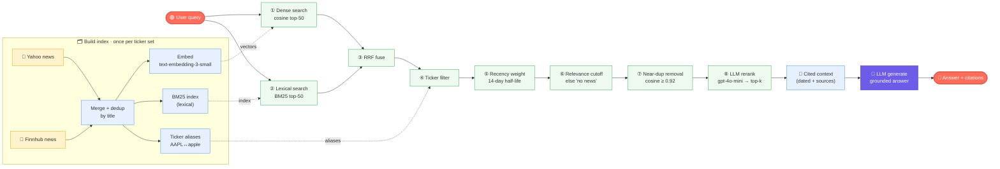

# RAG Subsystem — skibidiBrain

How the **news retrieval** half of the chatbot works. This is the only part of
the app that uses RAG; live numbers are *never* retrieved (see §8). Code lives in
`rag/` (`retriever.py`, `bm25.py`, `news_finnhub.py`) and is consumed by
`views/chat_view.py` + `services/chat_engine.py`.

---

## 🔄 RAG flow (n8n-style node graph)

A node-graph view of the whole pipeline — left-to-right like an n8n workflow.
The index is built once (top lane); each query then fans out to **dense** +
**lexical** search, merges, is filtered/ranked, and feeds the LLM.



> **Legend** — 🟧 trigger/result · 🟨 data source · 🟦 index/data artifact ·
> 🟩 retrieval step · 🟪 generation. Dashed arrows = an index artifact feeding a
> query step. Steps ①–⑧ map 1:1 to §6.

---

## 1. What problem RAG solves here

A language model can't know *today's* news, and if asked it will guess. So for
any "what's happening / why did it move / sentiment" question we:

1. **Retrieve** the most relevant recent news for the asked ticker, then
2. **Augment** the model's prompt with that text (with dates + sources), so it
3. **Generates** an answer grounded in—and citing—real articles.

Hence **R**etrieval-**A**ugmented **G**eneration.

## 2. Design principles

- **Retrieve text, fetch numbers.** Only unstructured news goes through RAG.
  Prices/financials are fetched live via tools — never embedded (avoids stale or
  hallucinated figures). This boundary is the project's central rule (§8).
- **Hybrid > pure vector.** Combine lexical (BM25) and semantic (embeddings)
  search; each catches what the other misses.
- **Precision via filtering + reranking.** Ticker filter and an LLM rerank keep
  only news that is actually about the asked company and question.
- **No external vector DB.** Corpus is a few hundred headlines — an in-memory
  NumPy matrix is faster to set up and dependency-free.

## 3. Data sources

| Source | Module | Coverage | Notes |
|--------|--------|----------|-------|
| **Yahoo Finance** | `retriever.fetch_news` (yfinance) | recent ~1–2 weeks | headline + summary, no key |
| **Finnhub** | `news_finnhub.fetch_company_news` | ~1 year (by date range) | optional `FINNHUB_API_KEY`; fills Yahoo's gap |

Both are normalized into the same `NewsChunk` shape and merged at index time.
Finnhub is also reachable on-demand for date-specific questions via the
`get_news_on_date` tool (outside the static index).

## 4. Data model

```python
NewsChunk:
    text       # "[2026-06-16] Headline. Summary…"  (date-prefixed, what we embed)
    title      # headline
    publisher  # outlet / provider
    link       # source URL (for citations)
    published  # ISO date (YYYY-MM-DD) or ""
    ticker     # symbol this item was fetched under (for filtering)

NewsIndex:
    chunks     # list[NewsChunk]
    matrix     # np.ndarray (n_chunks × dim), L2-normalized embeddings
    bm25       # BM25 over tokenized chunk texts
    symbols    # indexed tickers
    aliases    # {symbol: [name words]}  e.g. AAPL -> ["aapl", "apple"]
```

Embedding model: `text-embedding-3-small`. Rerank/chat model: `gpt-4o-mini`.

## 5. Index build — `build_index(client, symbols)`

```
for each symbol:
    fetch_news (Yahoo)  +  fetch_finnhub_recent (if key)   → NewsChunks (tagged ticker)
dedup by normalized title
embed all chunk texts          → L2-normalized matrix  (cosine == dot product)
BM25(tokenized texts)          → lexical index
aliases per symbol             → from yfinance shortName/longName (drop suffixes
                                  like Inc/Corp/Ltd), + the symbol itself
```

- Each chunk's text is **date-prefixed** (`[YYYY-MM-DD] …`) so date terms are
  embeddable and visible to BM25.
- Cached as a Streamlit **resource** per ticker set (built once, not per rerun).

## 6. Retrieval pipeline — `retrieve(client, index, query, k=6)`

```
query
 1. DENSE   embed(query) · matrix      → cosine scores → top-50 ranked ids
 2. LEXICAL bm25.scores(query)         → top-50 ranked ids
 3. FUSE    Reciprocal Rank Fusion (k=60) over the two rank lists
 4. FILTER  detect tickers in query (symbol or alias, word-boundary);
            if found, keep only those tickers' chunks (fallback to all if <3 left)
 5. RECENCY multiply fused score by 0.5 ** (age_days / 14)   (undated → 0.85)
 6. CUTOFF  take top-20 candidates; drop ones with cosine ≤ 0.15 AND bm25 == 0
            (if none survive → return [] so the bot can say "no relevant news")
 7. DEDUP   remove near-duplicates (cosine ≥ 0.92 between kept chunks)
 8. RERANK  LLM (gpt-4o-mini) reorders by true relevance, returns top-k ids
→ list[NewsChunk]
```

### Why each step
| Step | Purpose |
|------|---------|
| Dense | semantic match ("why is it falling" ↔ "shares slid") |
| BM25 | exact tokens embeddings blur — tickers, names, "DMA probe" |
| RRF | merge two rankings **without** fragile score-scaling |
| Ticker filter | stop "Apple" queries surfacing NVDA/MSFT news |
| Recency | newer news outranks month-old for "what's happening" |
| Cutoff | a real relevance floor → enables honest "I don't know" |
| Dedup | same story from two outlets shouldn't take two slots |
| Rerank | cheap final precision pass; drops weak candidates |

### Reciprocal Rank Fusion (RRF)
For each ranked list, a document at rank *r* contributes `1 / (60 + r)`; scores
are summed across lists. Rank-based, so dense and lexical scores never need to be
normalized onto a common scale.

### BM25 (`rag/bm25.py`)
Dependency-free. Tokenize → lowercase alphanumeric (len ≥ 2). Score with
`k1 = 1.5`, `b = 0.75` and Robertson-Spärck-Jones IDF
`log(1 + (N − df + 0.5)/(df + 0.5))`. O(query_terms × docs); fine for hundreds of
headlines.

## 7. Tuning knobs (`rag/retriever.py`)

| Constant | Default | Effect |
|----------|---------|--------|
| `EMBED_MODEL` | `text-embedding-3-small` | embedding quality/cost |
| `RERANK_MODEL` | `gpt-4o-mini` | rerank quality/cost |
| `CANDIDATES` | 20 | how many survive to dedup/rerank |
| `RRF_K` | 60 | fusion smoothing (higher = flatter) |
| `RECENCY_HALFLIFE` | 14 days | how fast old news is discounted |
| `NEAR_DUP_SIM` | 0.92 | dedup aggressiveness |
| `k` (call arg) | 6 | final chunks shown to the model |

## 8. The live-data vs. RAG boundary

```
numeric question  →  finance_tools (tool-calling)  →  FRESH from yfinance
                      (price, P/E, financials…)        never embedded
news / "why"      →  rag.retriever                  →  embedded news text only
```

The chatbot's system prompt enforces it: numbers must come from tools, narrative
from the NEWS CONTEXT. This prevents the model from inventing or quoting stale
prices.

## 9. How chat uses it

```python
# views/chat_view.py
chunks  = retriever.retrieve(client, index, prompt, k=6)
context = retriever.format_context(chunks)          # numbered, dated, cited
answer  = chat_engine.run_chat(client, messages, context)
# render answer + a "📰 News sources used" expander listing chunk titles/links
```

`format_context` renders each chunk as `[n] — DATE [TICKER] Title (publisher) …
Source: link`, so the model can cite `[1] [2]` and users can verify.

## 10. Date-specific questions

For "why was AAPL bearish on June 8?", the static index (recent news) may lack
that day. The chat then calls **`get_news_on_date(symbol, date)`**, which queries
Finnhub for a ±3-day window — a retrieval *fallback* beyond the in-memory index.
Paired with `get_price_on_date`, the answer combines the real move + that day's
news. (See systemflow.md §3.)

## 11. Limitations

- **Headlines + summaries only** — no full article bodies, so depth is bounded by
  what Yahoo/Finnhub return.
- **Recency of Yahoo news** (~1–2 weeks) unless Finnhub is configured.
- **One embedding call per query** (+ one rerank call) → small latency/cost.
- **In-memory index** rebuilt per session / ticker set (not persisted).
- **Ticker filter depends on aliases** derived from yfinance names; obscure
  aliases may be missed (it falls back to searching all chunks).

## 12. Extension points

- **Full-article RAG** — scrape article URLs, chunk bodies (500–800 tokens,
  overlap), embed chunks for deeper answers.
- **Persistent / larger store** — swap the NumPy matrix for FAISS or Chroma.
- **More sources** — add any fetcher returning `NewsChunk`s; merge in `build_index`.
- **Cross-encoder rerank** — replace the LLM rerank for lower latency at scale.
- **Query rewriting / HyDE** — expand vague queries before retrieval.

---

*See also: [systemarchitecture.md](systemarchitecture.md) §3 (subsystem design),
[systemflow.md](systemflow.md) §1 & §3 (request flows), [SRS.md](SRS.md) FR-CB-5.*
