# System Architecture

Static component design for skibidiBrain. For runtime request
flows, see [systemflow.md](systemflow.md).

---

## 1. Layered overview

The app follows a strict **3-layer separation**: UI → logic → data/retrieval.
Dependencies point downward only; lower layers never import `views/` or `app.py`.

```
┌──────────────────────────────────────────────────────────────┐
│  app.py            entry point · sidebar · shared state · tabs │
└───────────────┬──────────────────────────────────────────────┘
                │ dispatches to
┌───────────────▼──────────────────────────────────────────────┐
│  views/        PRESENTATION (Streamlit UI only)               │
│  watchlist · monitor · chart · fundamentals · predict · chat  │
└───────┬─────────────────────────────────────────┬────────────┘
        │ call                                     │ call
┌───────▼───────────────────────┐   ┌─────────────▼─────────────┐
│  services/   LOGIC + DATA      │   │  rag/   RETRIEVAL          │
│  finance_tools   (yfinance)    │   │  retriever  (hybrid RAG)   │
│  fundamentals    (yfinance)    │   │  bm25       (lexical)      │
│  charting        (yfinance)    │   │  news_finnhub (HTTP)       │
│  chat_engine     (OpenAI)      │   └─────────────┬─────────────┘
│  prediction      (yfinance)    │                 │
│  magic_monitor   (yfinance)    │                 │
│  sectors         (yfinance)    │                 │
│  presets · watchlist (data)    │                 │
└───────┬────────────────────────┘                │
        │                                          │
        ▼                  external                ▼
   ┌─────────┐        ┌──────────┐         ┌────────────┐
   │ yfinance│        │  OpenAI  │         │  Finnhub   │
   │ (Yahoo) │        │  API     │         │  API       │
   └─────────┘        └──────────┘         └────────────┘
```

### Visual (n8n-style node graph)

```mermaid
flowchart LR
    APP["🧩 app.py<br/>sidebar · state · tabs"]:::root

    subgraph V["🖼️ views · UI"]
        direction TB
        WL[watchlist_view]:::view
        MN[monitor_view]:::view
        CH[chart_view]:::view
        FN[fundamentals_view]:::view
        PR[prediction_view]:::view
        CB[chat_view]:::view
    end

    subgraph S["⚙️ services · logic + data"]
        direction TB
        FT[finance_tools]:::svc
        CE[chat_engine]:::svc
        PD[prediction]:::svc
        MM[magic_monitor]:::svc
        SE[sectors]:::svc
        FU[fundamentals]:::svc
        CHT[charting]:::svc
        WS[watchlist]:::svc
    end

    subgraph R["🔍 rag · retrieval"]
        direction TB
        RET[retriever]:::svc
        BM[bm25]:::svc
        NF[news_finnhub]:::svc
    end

    APP --> V
    V --> S
    V --> R
    S --> YF["📈 yfinance / Yahoo"]:::ext
    S --> OA["🤖 OpenAI"]:::ext
    R --> YF
    R --> OA
    R --> FH["📰 Finnhub"]:::ext

    classDef root fill:#6c5ce7,stroke:#4834d4,color:#fff;
    classDef view fill:#e7f0ff,stroke:#4a90d9,color:#333;
    classDef svc fill:#eef9f0,stroke:#34a853,color:#333;
    classDef ext fill:#fff3cd,stroke:#e0a800,color:#333;
```



> Dependencies point **downward only**: `app.py` → `views/` → `services/` & `rag/`
> → external APIs. Lower layers never import upward.

---

## 2. Components

### `app.py` — composition root
- Loads env, sets page config, builds the sidebar (API keys, ticker list).
- Owns **shared state**: the cached OpenAI client and the cached news index.
- Creates the six tabs and dispatches each to its `views/` module.
- Holds no business logic — pure wiring.

### `views/` — presentation layer
Each module exposes a `render(...)` function and contains **only** Streamlit UI +
view-specific caching. They never call external APIs directly; they go through
`services/` and `rag/`.

| Module | Renders | Depends on |
|--------|---------|------------|
| `watchlist_view` | multi-list quotes table, add/remove, list selector | `services.watchlist`, `services.finance_tools` |
| `monitor_view` | sector-grouped MTF screener table | `services.magic_monitor`, `services.sectors`, `services.watchlist` |
| `chart_view` | candlestick chart(s) | `services.charting` |
| `fundamentals_view` | metrics + statements | `services.fundamentals` |
| `prediction_view` | 5-day signal + factor breakdown | `services.prediction` |
| `chat_view` | chat transcript + input | `rag.retriever`, `services.chat_engine` |

### `services/` — logic + data access
| Module | Responsibility | External |
|--------|----------------|----------|
| `finance_tools` | Live quotes/financials/date-price as **OpenAI tool functions** + their JSON schemas | yfinance, (Finnhub via `news_finnhub`) |
| `fundamentals` | `.info` + statements, scale-aware formatting | yfinance |
| `charting` | OHLC fetch + resample (45M/3h) + Plotly figure assembly | yfinance, plotly |
| `chat_engine` | System prompt, tool-calling loop, tool-result caching | OpenAI |
| `prediction` | 5-day-forward mean-reversion signal (ADX/RSI/MTF) | yfinance |
| `magic_monitor` | MTF screener rows (signal/regime/RSI/returns) | yfinance |
| `sectors` | Sector/theme classification (curated + yfinance) | yfinance |
| `presets` | Magic Monitor preset tickers (parsed from PDF) | — |
| `watchlist` | Named multi-lists + active selection in `watchlist.json` | filesystem |

### `rag/` — retrieval subsystem
| Module | Responsibility | External |
|--------|----------------|----------|
| `retriever` | Fetch+embed news, build index, **hybrid retrieve** | yfinance, OpenAI (embeddings + rerank) |
| `bm25` | Dependency-free BM25 lexical scoring | — |
| `news_finnhub` | Company-news HTTP client (historical) | Finnhub |

---

## 3. The hybrid RAG subsystem (detail)

```
                       ┌──────────── build_index() ───────────┐
  Yahoo news ─┐        │ fetch per ticker → dedup by title     │
              ├──────▶ │ embed (text-embedding-3-small) → matrix│
  Finnhub news┘        │ BM25(tokenized texts)                 │
                       │ aliases per symbol (AAPL↔apple)        │
                       └───────────────┬───────────────────────┘
                                       ▼  NewsIndex
                       ┌──────────── retrieve() ───────────────┐
  query ─────────────▶ │ dense cosine ranks ─┐                 │
                       │ BM25 ranks ─────────┤ RRF fusion      │
                       │ ticker filter (query mentions AAPL)   │
                       │ recency weighting (14-day half-life)  │
                       │ near-dup removal (cos ≥ 0.92)         │
                       │ LLM rerank (gpt-4o-mini) → top-k      │
                       └───────────────┬───────────────────────┘
                                       ▼  list[NewsChunk] (cited)
```

**Data model**
- `NewsChunk` — `text, title, publisher, link, published, ticker`
- `NewsIndex` — `chunks, matrix (np), bm25, symbols, aliases`

**Why these choices**
- *In-memory numpy* over a vector DB: corpus is hundreds of headlines; avoids a
  heavy dependency and external service.
- *Hybrid BM25 + dense*: embeddings blur exact tokens (tickers, "DMA probe");
  BM25 recovers them. RRF fuses without fragile score normalization.
- *Ticker filtering*: keeps "Apple" questions from surfacing NVDA/MSFT news.
- *LLM rerank*: a cheap final precision pass over fused candidates.

---

## 4. Live-data vs. RAG (the key boundary)

```
              ┌─────────────────────────────┐
  numbers ───▶│ finance_tools (tool-calling)│──▶ always FRESH from yfinance
  (price,     └─────────────────────────────┘    never embedded / never cached >15m
   P/E, …)
              ┌─────────────────────────────┐
  narrative ─▶│ rag.retriever               │──▶ embedded news text only
  (news, why) └─────────────────────────────┘
```

This boundary is the project's central design rule: **structured numbers are
fetched, unstructured text is retrieved.** It prevents the model from
hallucinating or serving stale prices.

---

## 5. Tool-calling contract

`services/finance_tools.py` exports two parallel structures kept in sync:

- `TOOL_FUNCTIONS: dict[name → callable]` — the Python implementations
- `TOOL_SCHEMAS: list[json schema]` — the OpenAI function definitions

`chat_engine.run_chat()` passes `TOOL_SCHEMAS` to the model; when the model emits
a `tool_call`, the engine dispatches via `TOOL_FUNCTIONS[name]` (through a 15-min
cache) and feeds the JSON result back. Tools:

| Tool | Returns |
|------|---------|
| `get_stock_price` | latest price snapshot |
| `get_company_info` | profile + valuation metrics |
| `get_financials` | income-statement highlights |
| `get_historical_performance` | return over a period |
| `get_price_on_date` | OHLC + % move on a specific date |
| `get_news_on_date` | Finnhub news around a date |
| `get_price_prediction` | experimental 5-day-forward signal |

---

## 6. Configuration & secrets

| Item | Location | Notes |
|------|----------|-------|
| `OPENAI_API_KEY` | `.env` or sidebar | required |
| `FINNHUB_API_KEY` | `.env` or sidebar | optional; enables historical news |
| Server port (8600) | `.streamlit/config.toml` | |
| Watchlist | `watchlist.json` | gitignored, user data |
| Chat model | `services/chat_engine.py` (`CHAT_MODEL`) | `gpt-4o-mini` default |

`.env`, `.venv/`, and `watchlist.json` are gitignored.

---

## 7. External dependencies

| Service | Used for | Failure mode |
|---------|----------|--------------|
| **yfinance** (Yahoo) | prices, financials, OHLC, recent news | functions return `{error: …}`; UI shows warnings |
| **OpenAI** | chat completions, embeddings, rerank | surfaced as exceptions; rerank falls back to fusion order |
| **Finnhub** | historical company news | no-ops gracefully when key absent or request fails |

The app degrades gracefully: no Finnhub key → recent-only news; a failed quote →
"unavailable" row; empty news index → warning but live tools still work.

---

## 8. Extension points

- **New page** → add a `views/<x>_view.py` with `render()` + one tab line in `app.py`.
- **New live tool** → add a function + schema to `finance_tools.py` (auto-available to the chat).
- **New news source** → add a fetcher returning `NewsChunk`s; merge in `build_index`.
- **Swap vector store** → replace the numpy matrix in `retriever.py` (e.g. FAISS/Chroma) for larger corpora.
- **Deeper RAG** → scrape full article bodies + chunk them before embedding.
