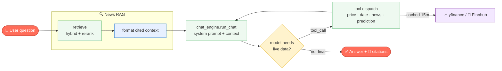

# System Flow

End-to-end request flows for skibidiBrain. Each section traces a
user action from the UI through `views/` → `services/`/`rag/` → external APIs and
back. For the static component design, see [systemarchitecture.md](systemarchitecture.md).

---

## 🔄 Chat lifecycle (n8n-style node graph)

The chatbot request loop — RAG provides cited context, then the model may loop
through live tool calls before answering.



> The `tool dispatch → run_chat` arrow is the tool-calling **loop** (up to 5
> rounds) — the model can chain calls (e.g. confirm a date's price *and* fetch
> that day's news) before producing the final answer.

---

## 0. App startup

```
streamlit run app.py
        │
        ├─ load_dotenv()                      # read .env (OPENAI_API_KEY, FINNHUB_API_KEY)
        ├─ st.set_page_config(...)
        ├─ render sidebar (keys, ticker list seeded from watchlist.load())
        ├─ get_client()         ──cache_resource──▶ OpenAI()           # once
        ├─ get_news_index(tickers) ─cache_resource─▶ retriever.build_index()
        │        └─ fetch news (Yahoo + Finnhub) → embed → BM25 → aliases
        └─ render tabs: ⭐ Watchlist · 🪄 Monitor · 📊 Chart · 🏦 Fundamentals · 🔮 Predict · 💬 Chat
```

The OpenAI client and news index are cached as **resources**, so they are built
once per session / per ticker set, not on every interaction (Streamlit reruns the
whole script on each widget change).

---

## 1. Chat — general news/sentiment question

> *"What's driving Apple's stock lately?"*

```
chat_view.render(client, index)
   │  user submits prompt via st.chat_input
   ▼
retriever.retrieve(client, index, prompt, k)         ── HYBRID RAG ──
   │  1. embed query                  → cosine ranks   (dense)
   │  2. BM25.scores(query)           → bm25 ranks      (lexical)
   │  3. RRF fuse(cosine, bm25)
   │  4. detect tickers in query → filter to AAPL chunks
   │  5. recency weighting (newer ↑)
   │  6. near-duplicate removal
   │  7. LLM rerank candidates → top-k
   ▼
retriever.format_context(chunks)      → numbered, dated, cited block
   ▼
chat_engine.run_chat(client, messages, news_context)
   │  system prompt (+ today's date) + NEWS CONTEXT + history
   │  model answers directly from context (no tool needed)
   ▼
st.markdown(answer) + "📰 News sources used" expander
```

---

## 2. Chat — live number question

> *"What's NVDA trading at?"*

```
retrieve() → (little/no relevant news) → context may be "No relevant news found."
   ▼
chat_engine.run_chat(...)
   │  model decides it needs live data → emits tool_call
   ▼
loop: for each tool_call:
   cached_tool_call(name, args)   ──cache_data(15m)──▶ finance_tools.get_stock_price()
        └─ yfinance Ticker.fast_info → {last, change, %…}
   append tool result → model called again
   ▼
model produces final answer with fresh numbers
```

The loop runs up to 5 rounds, so the model can chain calls (e.g. compare two
tickers = two `get_company_info` calls).

---

## 3. Chat — date-specific question (the headline feature)

> *"Why was AAPL bearish on June 8?"*

```
retrieve()  → hybrid RAG returns recent AAPL context (may lack June 8)
   ▼
chat_engine.run_chat(...)
   │  system prompt rule: for date questions, confirm the move first
   │
   ├─ tool_call: get_price_on_date("AAPL", "2026-06-08")
   │       └─ yfinance history window → OHLC, % vs prior close, direction
   │          → { close 301.54, change_percent -1.89, direction "bearish" }
   │
   └─ tool_call: get_news_on_date("AAPL", "2026-06-08")
           └─ news_finnhub.fetch_company_news(±3 days)   [needs FINNHUB_API_KEY]
              → list of dated headlines/summaries
   ▼
model synthesizes: real % move + news explanation, honest if news is thin
   ▼
answer ("…closed -1.89%… driven by …  This is not financial advice.")
```

**Date resolution:** the system prompt is injected with today's date, so "June 8"
→ current year, never a future date. Weekends/holidays fall back to the prior
trading day inside `get_price_on_date`.

---

## 4. Watchlist tab

```
watchlist_view.render()
   │
   ├─ 📋 List selectbox → watchlist.set_active(name) → st.rerun()   (multi-list)
   ├─ Add ticker → watchlist.add(sym, name) → writes watchlist.json → st.rerun()
   ├─ Remove (🗑) → watchlist.remove(sym, name) → writes watchlist.json → st.rerun()
   ├─ ↻ Refresh → _quote.clear() (drop 60s cache) → st.rerun()
   │
   └─ for each ticker in load(active):
        _quote(sym) ──cache_data(60s)──▶ finance_tools.get_stock_price()
                                          └─ yfinance fast_info
        render row: price · 🟢▲/🔴▼ change · day range · remove
```

`watchlist.json` stores **named lists + an active selection** (`My Watchlist`,
`Magic Monitor`). The active list also seeds the sidebar "Tickers to index for
news" default, so following a stock auto-includes it in the RAG index.

---

## 5. Monitor tab (Magic Monitor screener)

```
monitor_view.render()
   │  inputs: 📋 list selector + editable tickers + ↻ refresh
   ▼
_table(tickers) ──cache_data(5m)──▶ magic_monitor.build_table()
   │   for each ticker:
   │     charting.get_ohlc(3h / 1D / 1W)        → per-TF EMA(9/21) signal:
   │            dir ▲▼ · bars since trigger · Δ% since trigger
   │     _adx(daily)  → Regime T(≥25)/R(<25)
   │     _rsi(daily)  → RSI + Ext (OB/OS)
   │     returns 1D/5D/30D/YTD/1Y
   │     sectors.get_sector(sym)  → theme/sector
   ▼
group rows by Sector (sectors.order_key) → per-group header + styled table
```

Capped lists (Magic Monitor preset = 25 tickers) keep the 3-timeframe scan within
Yahoo's rate limits.

---

## 6. Chart tab

```
chart_view.render(default_symbol)
   │  inputs: ticker, view (Single | Grid), timeframe, indicators
   ▼
_get_chart_data(symbol, timeframe) ──cache_data(5m)──▶ charting.get_ohlc()
   │      └─ yfinance history(interval, period)
   │         └─ 45M/3h: resample finer bars (15m→45min, 1h→3h)
   ▼
charting.build_figure(df, …, indicators)
   │      candlesticks + overlays (SMA/EMA/Bollinger) + panels (Volume/RSI/MACD)
   ▼
st.plotly_chart(...)        # Single = 1 fig; Grid = 2×2 (1W,1D,3h,45M)
```

---

## 7. Fundamentals tab

```
fundamentals_view.render(default_symbol)
   ▼
_get_fundamentals(symbol) ──cache_data(1h)──▶
   ├─ fundamentals.get_info()        → yfinance .info (snapshot metrics)
   └─ fundamentals.get_statements()  → income / balance / cashflow
   ▼
render: profile header
      · metric cards by group (Valuation / Profitability / Health / Dividends)
      · revenue & net-income bar chart (revenue_income_trend)
      · statements in expanders (format_statement → humanized $)
      · business summary
```

---

## 8. Predict tab

```
prediction_view.render(default_symbol)
   ▼
_predict(symbol) ──cache_data(15m)──▶ prediction.get_prediction()
   │   yfinance history(1y) →
   │     _adx → regime (Trending ≥25 / Ranging <25)
   │     recent 5d move → direction
   │     mean-reversion table → base expected fwd-5d %
   │     _rsi extreme nudge + multi-timeframe alignment
   ▼
render: signal banner (🟢/🔴/⚪) · expected move · strength bar
      · factor breakdown · ⚠️ experimental / not financial advice
```

Also exposed to the chatbot as the `get_price_prediction` tool.

---

## Caching summary

| Cache | Scope | TTL | Why |
|-------|-------|-----|-----|
| `get_client` | resource | session | one OpenAI client |
| `get_news_index` | resource | per ticker set | expensive: fetch + embed + BM25 |
| `cached_tool_call` | data | 15 min | rate-limit live tool data |
| `_quote` (watchlist) | data | 60 s | fresh-ish quotes |
| `_table` (monitor) | data | 5 min | multi-ticker × 3-timeframe scan |
| `_get_chart_data` | data | 5 min | OHLC fetch |
| `_get_fundamentals` | data | 1 h | slow-changing |
| `_predict` | data | 15 min | prediction signal |

Streamlit reruns the entire script on every interaction; caching is what keeps
that cheap and within API rate limits.
